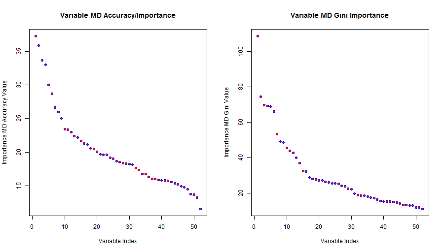

## Summary

#### Data Preparation
* I chose to use a Random Forest
* Since the implementation of Random Forest handles cross-validation, I only created Train and Test sets (80:20)

#### Model Selection
* I followed the lecture's advice and used rfcv() to evaluate cross-validation OOB error estimates
* I subsetted data down to 53 columns including 'classe' y column (discard column if NA/blank count > nrows/2)
* I used ranked Linear Model coefficients to extract 20 features  which should perform well
* I also used the Random Forest importance() output's feature error estimates for possible feature reduction, but rejected this because the plots (below) do not clearly delineate less-important features
* I then fit Random Forests over a grid/range of 'mtry' and 'ntree' parameters to find the best-performing values for these parameters for the full 52-feature training set (rf52)
* I did the same thing (grid/range of 'mtry' and 'ntree') for a 20-features derived data frame using the Linear Model coefficients for subsetting

#### Model Evaluation and OOB Error Estimates
* I then evaluated the performance of rf52 and rf20 on the TEST set
* I then compared the TEST set performance for the rf52 and rf20 Random Forests to the rfcv() and the Random Forests' built-in OOB estimates:

__Random Forest rf52</b> (trained using 52 features, mtry=2, ntree=20)__

* Train accuracy: 1.00000
* TEST set prediction accuracy: 99.1847%
* Random Forest rf52 built-in OOB error estimate: 2.3445%

__Random Forest rf20</b> (trained using 20 features, mtry=2, ntree=50)__

* Train accuracy: 1.00000
* TEST set prediction accuracy: 99.4395%
* Random Forest rf20 built-in OOB error estimate: 0.91%

__rfcv() OOB Error Estimates by Variable Count</b>__

* 52 variables: 0.005542460
* 26 variables: 0.007581066
* 13 variables: 0.009683379
* 6 variables:  0.045104160
* 3 variables:  0.109320252
* 1 variable:   0.596929350

#### Prediction on Project 20-row Prediction Set (pml-testing.csv)
* rf52: B  A  B  A  A  E  D  B  A  A  B  C  B  A  E  E  A  B  B  B
* rf20: B  A  B  A  A  E  D  B  A  A  B  C  B  A  E  E  A  B  B  B

#### Discussion
The rf20 Random Forest had slightly better performance than the rf52 RF even though the rf20 RF was trained using only 20 features.  I think the reason for this is that my grid search parameter optimization function assigned 50 trees to the rf20 RF whereas it only assigned 20 trees to the rf52 RF.

#### Notes
* I added a separate PDF file containing this R Markdown Course Project write-up
* I added a separate PDF file to my repo containing the test script's output (plots manually inserted)
* I added a separate CpScript.R file to my repo containing the test script 'driver' and various other 'helper' functions
* The R code is rather messy do to the sequence of steps taken and the print statements (sorry)
* The CpScript.R has a 'driver' test function named cpTest(), but only the steps inside this function are listed in this Rmd write-up, not the outer function itself
* Many of my helper functions return tuples containing multiple named return values

IMPORTANT: I could not get knitr to work with code chunks which call functions in another chunk.  Therefore, I am having to submit the code in chunks but NOT labeled as {r} code, and instead, am including a code chunk at the bottom with my entire (large) .R file.  As a result, the chunks in the write-up do not have syntax highlighting/coloring. This also forced me to manually insert both the code's output as well as HTML tags to intersperse my plots' PNG files instead of being generated by R/knitr.  SORRY!  Full code at bottom WITH syntax highlighting.

<hr>

### Begin 'Test Driver' Code Chunks, Output, and Plots

#### Loading and Processing the Data

Note: return value 'd' is a tuple
```
Code:
# load data, create and split data frames, shuffle rows, results stored in d tuple
d <- loadData( subDir, doPrint = TRUE )

Output:
[1] ---> loading data...
[1] ...done reading data and creating data frames

```

#### Assessing rfcv() Error Data for Feature Selection

Note: the plot resulting from the code, below, did not contain any obvious pattern to use for separating important from less-important features.
```
Code:
# see if rfcv() variable importance useful for features selection
evalRfcvVarImport( d$trainDf, nrows=2000, doPrint=TRUE )

Output:
[1] plotting Random Forest variable importance() metrics
[1] no clear dividing line differentiating important vs. unimportant variables
```


#### Fitting a Linear Model and Extracting 20 Largest Coefficients

Note: the plot resulting from the code below DID show that the error flattened out after using approximately 20 features.
```
Code:
# get sorted coefficients from Linear Model fit to see if useful
# for feature selection
lmBest20Coeffs <- getMostImportantLmCoeffs( d$trainDf, nrows=1000, doPrint=TRUE )

Output:
[1] ---> assessing whether Linear Model coefficients offer useful variable importance rankings...
[1] plotting Linear Model coefficients sorted in decreasing order
```


#### Finding Best 'ntree' and 'mtry' Random Forests for 52-feature TRAIN Set

Note: below, the code calls a function which chooses the best Random Forest and its 'mtry' and 'ntree' parameters over a range of values for these two variables.
```
Code:
# fit Random Forests over a grid of ranges for params 'mtry' and 'ntree'
# use full 52 features in training set
pr( "---> examining Random Forest performance for a range of 'mtry' and 'ntree' parameters..." )
mtryVals <- c( 2, 5, 10 )
ntreeVals <- c( 1, 2, 3, 5, 10, 20 )
rf52 <- findBestRfParams( d$trainDf, mtryVals, ntreeVals, doPrint = TRUE ) # rf52 is a tuple
pr( "--> Random Forest accuracy values for evaluated (mtry, ntree) grid pairs:" )
pr( "--> NOTE: row names are mtry values; column names are ntree values" )
pr( "--> NOTE: matrix entries are classification accuracy on train set" )
cat( "\n" )
pr( rf52$accMatrix )
cat( "\n" )    
pr( "--->parameters from best 52-feature Random Forest:" )
pr( sprintf( "resultant rf52: train accuracy=%f mtry=%d ntree=%d OOB error=%f",
    rf52$bestAcc, rf52$bestMtry, rf52$bestNtree, getOob( rf52$bestRf ) ) )
cat( "\n" )

# now just print out the Random Forest to get confusion matrix and OOB error est.
pr( "---> printing best (rf52) Random Forest for above parameters: " )
pr( rf52$bestRf )
cat( "\n" )

Output:
[1] ---> examining Random Forest performance for a range of 'mtry' and 'ntree' parameters...
[1] evaluating Random Forest w/ mtry=2 ntree=1
[1] evaluating Random Forest w/ mtry=2 ntree=2
[1] evaluating Random Forest w/ mtry=2 ntree=3
[1] evaluating Random Forest w/ mtry=2 ntree=5
[1] evaluating Random Forest w/ mtry=2 ntree=10
[1] evaluating Random Forest w/ mtry=2 ntree=20
[1] evaluating Random Forest w/ mtry=5 ntree=1
[1] evaluating Random Forest w/ mtry=5 ntree=2
[1] evaluating Random Forest w/ mtry=5 ntree=3
[1] evaluating Random Forest w/ mtry=5 ntree=5
[1] evaluating Random Forest w/ mtry=5 ntree=10
[1] evaluating Random Forest w/ mtry=5 ntree=20
[1] evaluating Random Forest w/ mtry=10 ntree=1
[1] evaluating Random Forest w/ mtry=10 ntree=2
[1] evaluating Random Forest w/ mtry=10 ntree=3
[1] evaluating Random Forest w/ mtry=10 ntree=5
[1] evaluating Random Forest w/ mtry=10 ntree=10
[1] evaluating Random Forest w/ mtry=10 ntree=20

[1] --> Random Forest accuracy values for evaluated (mtry, ntree) grid pairs:
[1] --> NOTE: row names are mtry values; column names are ntree values
[1] --> NOTE: matrix entries are classification accuracy on train set

           1         2         3         5        10        20
2  0.9548321 0.9512009 0.9906989 0.9978977 0.9997452 1.0000000
5  0.9720966 0.9693572 0.9950946 0.9984710 0.9998726 1.0000000
10 0.9684016 0.9678282 0.9948398 0.9984073 0.9998726 0.9999363

[1] --->parameters from best 52-feature Random Forest:
[1] resultant rf52: train accuracy=1.000000 mtry=2 ntree=20 OOB error=0.023445

[1] ---> printing best (rf52) Random Forest for above parameters: 

Call:
 randomForest(formula = classe ~ ., data = df, mtry = mt, ntree = nt) 
               Type of random forest: classification
                     Number of trees: 20
No. of variables tried at each split: 2

        OOB estimate of  error rate: 2.34%
Confusion matrix:
     A    B    C    D    E class.error
A 4394   22    9   14    2  0.01058320
B   45 2951   32   14   10  0.03309305
C    7   45 2610   30    7  0.03297518
D   12    3   63 2480   10  0.03426791
E    2   15    4   22 2893  0.01464578
```

#### Using rfcv() to Evaluate CV OOB Error

```
Code:
# now use rfcv() to evaluate cross-validation error
pr( "---> computing rfcv() cross-validation error - this may take several minutes..." )
set.seed( 1 )
rfcvOutput <- rfcv( d$trainDf[, -53], d$trainDf[, 53] )
pr( "...done computing rfcv() output" )
pr( "rfcv() cross-validation estimates for training set vs. number variables used:")
pr( rfcvOutput$error.cv )    
cat( "\n" )

Output:
[1] ---> computing rfcv() cross-validation error - this may take several minutes...
[1] ...done computing rfcv() output
[1] rfcv() cross-validation estimates for training set vs. number variables used:
         52          26          13           6           3           1 
0.005542460 0.007581066 0.009683379 0.045104160 0.109320252 0.596929350 
```

#### Evaluating TEST set accuracy of Random Forest (rf52) Trained on 52 Features

```
Code:
# compute performance of rf52 best 52-feature random forest on T-E-S-T set
acc <- evalRf( rf52$bestRf, d$testDf )
pr( sprintf( "accuracy of best (rf52) Random Forest on 20%% TEST set: %f", acc ) )
cat( "\n" )

Output:
[1] accuracy of best (rf52) Random Forest on 20% TEST set: 0.991847
```

#### Finding Best 'ntree' and 'mtry' Random Forests for 20-feature TRAIN Set

Note: because I was using fewer features, the 'mtry' and 'ntree' ranges I used for evaluation ranged to higher values than for the rf52 Random Forest grid search.
```
Code:
# additional exercise: find best 20-feature Random Forest using Linear Model top-20 coeffs
pr( "---> As additional exercise fit Random Forest to top-20 features from Linear Model" )
lmBest20Coeffs[ 21 ] = "classe" # Need to append the 'classe' to feature list
best20TrainDf <- d$trainDf[, lmBest20Coeffs ] # subset training set, only the 20 'top' features
mtryVals <- c( 2, 5, 10 ) # use different parameter ranges as expect lower accuracy using fewer features
ntreeVals <- c( 10, 50, 100, 200 ) # ditto
rf20 <- findBestRfParams( d$trainDf, mtryVals, ntreeVals, doPrint = TRUE )
pr( "--> Random Forest accuracy values for evaluated (mtry, ntree) grid pairs:" )
pr( "--> NOTE: row names are mtry values; column names are ntree values" )
pr( "--> NOTE: matrix entries are classification accuracy on train set" )
cat( "\n" )

pr( rf20$accMatrix )
cat( "\n" )    
pr( "--->parameters from best 20-feature Random Forest:" )
pr( sprintf( "resultant rf20: train accuracy=%f mtry=%d ntree=%d OOB error=%f",
             rf20$bestAcc, rf20$bestMtry, rf20$bestNtree, getOob( rf20$bestRf ) ) )
cat( "\n" )
    
# PRINT BEST RANDOM FOREST (to get OOB and confusion matrix)
pr( "---> printing best Random Forest for above parameters: " )
pr( rf20$bestRf )
cat( "\n" )    

Output:
[1] ---> As additional exercise fit Random Forest to top-20 features from Linear Model
[1] evaluating Random Forest w/ mtry=2 ntree=10
[1] evaluating Random Forest w/ mtry=2 ntree=50
[1] evaluating Random Forest w/ mtry=2 ntree=100
[1] evaluating Random Forest w/ mtry=2 ntree=200
[1] evaluating Random Forest w/ mtry=5 ntree=10
[1] evaluating Random Forest w/ mtry=5 ntree=50
[1] evaluating Random Forest w/ mtry=5 ntree=100
[1] evaluating Random Forest w/ mtry=5 ntree=200
[1] evaluating Random Forest w/ mtry=10 ntree=10
[1] evaluating Random Forest w/ mtry=10 ntree=50
[1] evaluating Random Forest w/ mtry=10 ntree=100
[1] evaluating Random Forest w/ mtry=10 ntree=200

[1] --> Random Forest accuracy values for evaluated (mtry, ntree) grid pairs:
[1] --> NOTE: row names are mtry values; column names are ntree values
[1] --> NOTE: matrix entries are classification accuracy on train set

          10 50 100 200
2  0.9997452  1   1   1
5  0.9998726  1   1   1
10 0.9998726  1   1   1

[1] --->parameters from best 20-feature Random Forest:
[1] resultant rf20: train accuracy=1.000000 mtry=2 ntree=50 OOB error=0.009110

[1] ---> printing best Random Forest for above parameters: 

Call:
 randomForest(formula = classe ~ ., data = df, mtry = mt, ntree = nt) 
               Type of random forest: classification
                     Number of trees: 50
No. of variables tried at each split: 2

        OOB estimate of  error rate: 0.91%
Confusion matrix:
     A    B    C    D    E class.error
A 4430    7    0    3    1 0.002476920
B   21 3020    8    1    2 0.010484928
C    3   28 2663    5    1 0.013703704
D    3    0   42 2519    4 0.019080997
E    0    3    1   10 2922 0.004768392
```

#### Evaluating TEST set accuracy of Random Forest (rf20) Trained on 20 Features

```
Code:
# compute performance of rf20 Random Forest on T-E-S-T set (20% of train set rows)
pr( "---> evalute top-20 feature Random Forest: " )
acc <- evalRf( rf20$bestRf, d$testDf )
pr( sprintf( "accuracy of best (rf20) Random Forest on 20%% TEST set: %f", acc ) )
cat( "\n" )

Output:
[1] ---> evalute top-20 feature Random Forest: 
[1] accuracy of best (rf20) Random Forest on 20% TEST set: 0.994395
```

#### Using rf52 and rf20 Models to Predict Labels for 20-Row Project Data (pml-testing.csv)

```
Code:
# use rf52 to predict labels for course project 20-row data set (pml-testing.csv)
pr( "---> use rf52 to predict labels for course project 20-row data set (pml-testing.csv" )
predsRf52 <- predict( rf52$bestRf, d$predDf )
pr( predsRf52 )
cat( "\n")

# use rf20 to predict labels for course project 20-row data set (pml-testing.csv)
pr( "---> use rf20 to predict labels for course project 20-row data set (pml-testing.csv" )
predsRf20 <- predict( rf20$bestRf, d$predDf )
pr( predsRf20 )
cat( "\n")

Output:
[1] ---> use rf52 to predict labels for course project 20-row data set (pml-testing.csv
 1  2  3  4  5  6  7  8  9 10 11 12 13 14 15 16 17 18 19 20 
 B  A  B  A  A  E  D  B  A  A  B  C  B  A  E  E  A  B  B  B 
Levels: A B C D E

[1] ---> use rf20 to predict labels for course project 20-row data set (pml-testing.csv
 1  2  3  4  5  6  7  8  9 10 11 12 13 14 15 16 17 18 19 20 
 B  A  B  A  A  E  D  B  A  A  B  C  B  A  E  E  A  B  B  B 
Levels: A B C D E
```

<hr>

### Full R Code with Syntax Highlighting and Coloring

```{r}
#######
# Usage:
# source( "CpScript.R" )
# set 'subDir' variable if != local sub-directory 'data'
# cpTest()
#######

library( randomForest )
cpScript <- function( subDir = "data" ) {

    repoDir <- "D:/OldLaptop/D_Drive/JohnsHopkinsCoursera/8_PracticalMLCoursera/hw/CourseProjRepo"    

    # load data, create and split data frames, shuffle rows, results stored in d tuple
    d <- loadData( subDir, doPrint = TRUE )
    
    # see if rfcv() variable importance useful for features selection
    evalRfcvVarImport( d$trainDf, nrows=2000, doPrint=TRUE )
    
    # get sorted coefficients from Linear Model fit to see if useful
    # for feature selection
    lmBest20Coeffs <- getMostImportantLmCoeffs( d$trainDf, nrows=1000, doPrint=TRUE )

    # fit Random Forests over a grid of ranges for params 'mtry' and 'ntree'
    # use full 52 features in training set
    pr( "---> examining Random Forest performance for a range of 'mtry' and 'ntree' parameters..." )
    mtryVals <- c( 2, 5, 10 )
    ntreeVals <- c( 1, 2, 3, 5, 10, 20 )
    rf52 <- findBestRfParams( d$trainDf, mtryVals, ntreeVals, doPrint = TRUE ) # rf52 is a tuple
    pr( "--> Random Forest accuracy values for evaluated (mtry, ntree) grid pairs:" )
    pr( "--> NOTE: row names are mtry values; column names are ntree values" )
    pr( "--> NOTE: matrix entries are classification accuracy on train set" )
    cat( "\n" )
    pr( rf52$accMatrix )
    cat( "\n" )    
    pr( "--->parameters from best 52-feature Random Forest:" )
    pr( sprintf( "resultant rf52: train accuracy=%f mtry=%d ntree=%d OOB error=%f",
        rf52$bestAcc, rf52$bestMtry, rf52$bestNtree, getOob( rf52$bestRf ) ) )
    cat( "\n" )
    
    # now just print out the Random Forest to get confusion matrix and OOB error est.
    pr( "---> printing best (rf52) Random Forest for above parameters: " )
    pr( rf52$bestRf )
    cat( "\n" )
    
    # now use rfcv() to evaluate cross-validation error
    pr( "---> computing rfcv() cross-validation error - this may take several minutes..." )
    set.seed( 1 )
    rfcvOutput <- rfcv( d$trainDf[, -53], d$trainDf[, 53] )
    pr( "...done computing rfcv() output" )
    pr( "rfcv() cross-validation estimates for training set vs. number variables used:")
    pr( rfcvOutput$error.cv )    
    cat( "\n" )

    # compute performance of rf52 best 52-feature random forest on T-E-S-T set
    acc <- evalRf( rf52$bestRf, d$testDf )
    pr( sprintf( "accuracy of best (rf52) Random Forest on 20%% TEST set: %f", acc ) )
    cat( "\n" )

    # additional exercise: find best 20-feature Random Forest using Linear Model top-20 coeffs
    pr( "---> As additional exercise fit Random Forest to top-20 features from Linear Model" )
    lmBest20Coeffs[ 21 ] = "classe" # Need to append the 'classe' to feature list
    best20TrainDf <- d$trainDf[, lmBest20Coeffs ] # subset training set, only the 20 'top' features
    mtryVals <- c( 2, 5, 10 ) # use different parameter ranges as expect lower accuracy using fewer features
    ntreeVals <- c( 10, 50, 100, 200 ) # ditto
    rf20 <- findBestRfParams( d$trainDf, mtryVals, ntreeVals, doPrint = TRUE )
    pr( "--> Random Forest accuracy values for evaluated (mtry, ntree) grid pairs:" )
    pr( "--> NOTE: row names are mtry values; column names are ntree values" )
    pr( "--> NOTE: matrix entries are classification accuracy on train set" )
    cat( "\n" )

    pr( rf20$accMatrix )
    cat( "\n" )    
    pr( "--->parameters from best 20-feature Random Forest:" )
    pr( sprintf( "resultant rf20: train accuracy=%f mtry=%d ntree=%d OOB error=%f",
                 rf20$bestAcc, rf20$bestMtry, rf20$bestNtree, getOob( rf20$bestRf ) ) )
    cat( "\n" )
    
    # PRINT BEST RANDOM FOREST (to get OOB and confusion matrix)
    pr( "---> printing best Random Forest for above parameters: " )
    pr( rf20$bestRf )
    cat( "\n" )    

    # compute performance of rf20 Random Forest on T-E-S-T set (20% of train set rows)
    pr( "---> evalute top-20 feature Random Forest: " )
    acc <- evalRf( rf20$bestRf, d$testDf )
    pr( sprintf( "accuracy of best (rf20) Random Forest on 20%% TEST set: %f", acc ) )
    cat( "\n" )

    # use rf52 to predict labels for course project 20-row data set (pml-testing.csv)
    pr( "---> use rf52 to predict labels for course project 20-row data set (pml-testing.csv" )
    predsRf52 <- predict( rf52$bestRf, d$predDf )
    pr( predsRf52 )
    cat( "\n")

    # use rf20 to predict labels for course project 20-row data set (pml-testing.csv)
    pr( "---> use rf20 to predict labels for course project 20-row data set (pml-testing.csv" )
    predsRf20 <- predict( rf20$bestRf, d$predDf )
    pr( predsRf20 )
    cat( "\n")
        
    # RETURN LIST OF SELECTED VARIABLES FOR CALLER
    list( data=d, lmBest20Coeffs=lmBest20Coeffs, rf52=rf52, rf20=rf20,
          rfcvOutput=rfcvOutput, predsrf52=predsrf52, predsRf20=predsRf20 )
}

###########
# helper function which fits a Linear Model and returns
# return value = 20 largest sorted coefficients of Linear Model
getMostImportantLmCoeffs <- function( df, nrows=0, doPrint=FALSE ) {
    if ( nrows == 0 )
        nrows = nrow( df )
    # EVAL LINEAR MODEL COEFFICIENT RANKING FOR *FEATURE SELECTION* (result: useful)
    # now try ranking variables by Linear Model coefficient values
    if ( doPrint )
        pr( "---> assessing whether Linear Model coefficients offer useful variable importance rankings..." )
    classeIdx <- getColIdx( df, "classe" )
    y <- as.numeric( df[ 1:nrows, classeIdx ] ) # use only 1,000 rows for LM fit
    lmDf <- cbind( df[ 1:nrows , 1:classeIdx - 1 ], y  )
    set.seed( 1 ) # set RNG seed for reproducibility
    lmFit <- lm( y ~ . , data = lmDf )
    sortedCoeffs <- sort( abs( lmFit$coefficients ), decreasing = TRUE )
    nCoeffs <- length( sortedCoeffs )
    sortedCoeffNames <- names( sortedCoeffs[2:nCoeffs ] )
    lm20MostImpFeatures <- names(sortedCoeffs)[2:21]  # skip intercept = coef[1]
    # plot linear model coefficients largest-to-smallest; skipping intercept coefficient
    plotLmCoeffVals( 2:nCoeffs, sortedCoeffs[2:nCoeffs], doPrint=doPrint )
    if ( doPrint )
        cat( "\n" )
    lmBest20Coeffs <- sortedCoeffNames[2:21]
}

###########
# helper function to use rfcv() output ranking of variables to see
# if the rankings are useful for feature selection/reduction
evalRfcvVarImport <- function( df, nrows=0, doPrint = FALSE ) {
    # evaluate rfcv() output to see if useful for feature selection
    if ( nrows == 0 )
        nrows = nrow( df )
    set.seed( 1 )
    rf <- randomForest( classe ~ ., data = df[1:nrows, ], importance = TRUE )
    impVal <- as.data.frame( importance( rf ) )
    impValMda <- impVal[ rev( order( impVal$MeanDecreaseAccuracy ) ), ]
    impValGini <- impVal[ rev( order( impVal$MeanDecreaseGini ) ), ]
    mdaDf <- data.frame( rownames( impValMda ), impValMda$MeanDecreaseAccuracy )
    giniDf <- data.frame( rownames( impValGini ), impValGini$MeanDecreaseGini )
    nVars <- nrow( mdaDf )
    # plot the results
    par( mfrow = c( 1, 2 ) )
    plotImportanceData( 1:nVars, mdaDf[,2], giniDf[,2], doPrint=doPrint )
    # plot conclusion - no clear dividing line between important vs. unimportant variables
    # results not actionable
    if ( doPrint ) {
        pr( "no clear dividing line differentiating important vs. unimportant variables" )
        cat( "\n" )
    }
}

###########
# helper function to load, subset, and shuffle data
# output: various data frames
# read and subset/process 2 CSV files, create data frames
loadData <- function( subDir = "data", doPrint = FALSE ) {
    if ( doPrint )
        pr( "---> loading data..." )
    trainFile <- file.path( subDir, "pml-training.csv" ) 
    testFile <- file.path( subDir, "pml-testing.csv" )
    trainFileDf <- prepDf( read.csv( trainFile ) )
    predDf <- prepDf( read.csv( testFile ) ) # 20-row prediction file
    set.seed( 1 ) # set seed for shuffle operation
    nrows <- nrow( trainFileDf )
    trainFileDf <- trainFileDf[ sample( nrows ), ] # randomly shuffle rows
    # Partition: 80% train, 20% test
    trainDf <- trainFileDf[ 1 : as.integer( 0.8 * nrows ), ]
    testDf <- trainFileDf[ as.integer( nrow( trainDf ) + 1 ) : nrows, ]
    if ( doPrint ) {
        pr( "...done reading data and creating data frames")
        cat( "\n" )
    }
    list( trainDf=trainDf, testDf=testDf, predDf=predDf )
}

###########
# helper function to evaluate Random Foresets over range of mtry and ntree parameter
findBestRfParams <- function( df, mtryVals, ntreeVals, doPrint = FALSE ) {
    bestAcc <- 0
    bestMtry <- 0
    bestNtree <- 0
    bestRf <- NULL
    accMatrix <- matrix( nrow=length( mtryVals ), ncol=length( ntreeVals ) )
    rownames( accMatrix ) <- as.character( mtryVals )
    colnames( accMatrix ) <- as.character( ntreeVals )
    for ( i in 1:length( mtryVals ) ) {                     # mtry
        mt <- mtryVals[ i ]
        for ( j in 1:length( ntreeVals ) ) {                # ntree
            nt <- ntreeVals[ j ]
            if ( doPrint )
                pr( sprintf( "evaluating Random Forest w/ mtry=%d ntree=%d", mt, nt ) )
            set.seed( 1 )
            rf <- randomForest( classe ~ ., data=df, mtry=mt, ntree=nt )
            acc <- evalRf( rf, df )
            accMatrix[i, j] = acc
            if ( acc > bestAcc ) {
                bestMtry <- mt
                bestNtree <- nt
                bestRf <- rf
                bestAcc <- acc
            }
        }
    }
    if ( doPrint )
        cat( "\n" )
    list( bestAcc=bestAcc, bestMtry=bestMtry, bestNtree=bestNtree, 
          bestRf=bestRf, accMatrix=accMatrix )
}

###########
# helper method to get OOB error estimate from Random Forest
getOob <- function( rf ) {
    rf$err.rate[rf$ntree, 1 ]
}


###########
# helper method to evaluate classification accuracy of Random Forest wrt a data frame
evalRf <- function( rf, df )  {
    predTestSet <- predict( rf, df ) # use Test set, NOT Cross-Validation set
    numAgree <- sum( predTestSet == df$classe )
    modelTestAccur <- numAgree/length( predTestSet )
}

###########
# helper method to reduce line lengths
pr <- function( msg ) {
    print( msg, quote = FALSE )
}

###########
# helper to de-clutter script code
plotLmCoeffVals <- function( coefIdxs, coefVals, doPrint=FALSE ) {
    
    if ( doPrint )
        pr( "plotting Linear Model coefficients sorted in decreasing order" )
    
    # plot to screen and knitr
    plot( coefIdxs, coefVals, pch=21, col="blue", bg="red",
          xlab="Linear Model Coef Index", 
          ylab="LM Coef Value", 
          main="Linear Model Coefficients" )
    lines(coefIdxs, coefVals, col="blue" )

    # also plot to PNG file
    png( "LmCoeff.png", height = 512, width = 512 )
    par( family = "sans" )
    plot( coefIdxs, coefVals, pch=21, col="blue", bg="red",
          xlab="Linear Model Coef Index", 
          ylab="LM Coef Value", 
          main="Linear Model Coefficients" )
    lines(coefIdxs, coefVals, col="blue" )
    dev.off()    
    
    if ( doPrint )
        cat( "\n" )
}

###########
# helper to de-clutter script code
plotImportanceData <- function( varIndices, mdaVals, mdGiniVals, doPrint=FALSE ) {
    
    if ( doPrint )
        pr( "plotting Random Forest variable importance() metrics" )
    
    # plot to screen and knitr
    plot( varIndices, mdaVals, 
          xlab="Variable Index", 
          ylab="Importance MD Accuracy Value", 
          main="MD Accuracy Importance of Variables",
          pch=21, col="blue", bg="red" )
    plot( varIndices, mdGiniVals,
          xlab="Variable Index", 
          ylab="Importance MD Gini Value", 
          main="MD Gini Importance of Variables",
          pch=21, col="blue", bg="red" )
    
    # plot to file as well
    png( "RfImpVarMetrics.png", height = 512, width = 900 )
    par( family = "sans" )
    par( mfrow = c( 1, 2 ) )
    plot( varIndices, mdaVals, 
        xlab="Variable Index", 
        ylab="Importance MD Accuracy Value", 
        main="MD Accuracy Importance of Variables",
        pch=21, col="blue", bg="red" )
    plot( varIndices, mdGiniVals,
        xlab="Variable Index", 
        ylab="Importance MD Gini Value", 
        main="MD Gini Importance of Variables",
        pch=21, col="blue", bg="red" )
    dev.off()
    if ( doPrint )
        cat( "\n" )
}

###########
# helper function to subset, coerce data
prepDf <- function( df ) {
    ## discard first 7 columns - may not be good for general data sets
    df <- df[ , 8:ncol( df ) ]
    ## discard columns with number na/blanks > num rows in data frame
    colNaSums <- apply( df, 2, function(x) { length( which ( is.na(x) | x == "" ) ) } )
    df <- df[ ,colNaSums < nrow(df)/2 ]
    ## coerce integers to numeric
    for ( i in 1:ncol( df ) ) {
        if ( class( df[ 1, i ] ) == "integer" )
            df[ , i ] <- as.numeric( df[ , i ] )
    }
    df # Caller must do the shuffling
}

###########
# a function which returns the numeric index of column in a data frame given the column name
getColIdx <- function( df, colName ) {
    grep( colName, colnames( df ) )
}


```